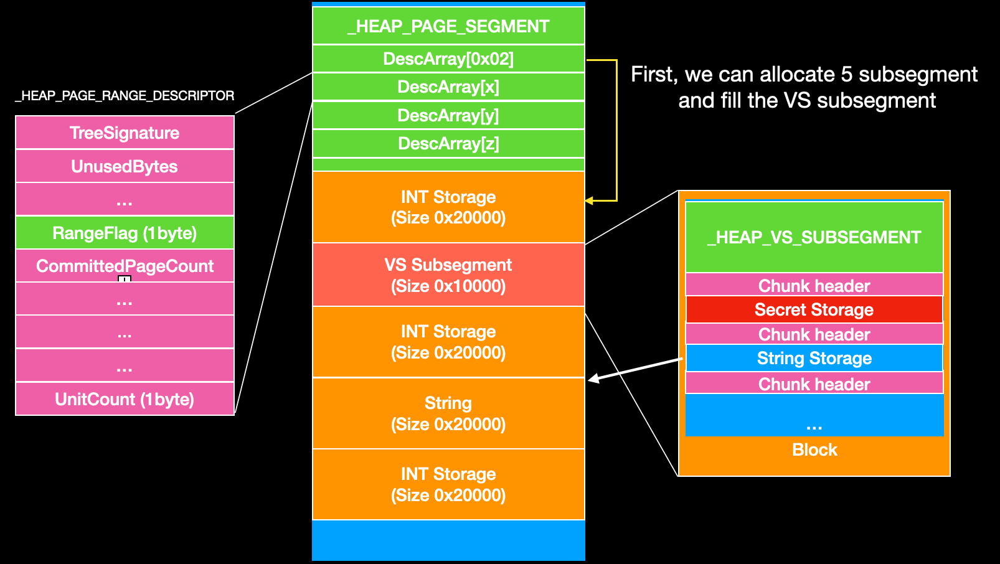
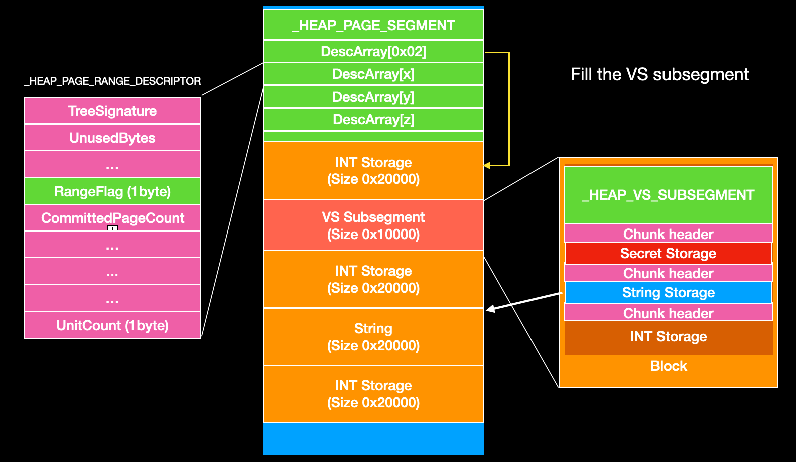
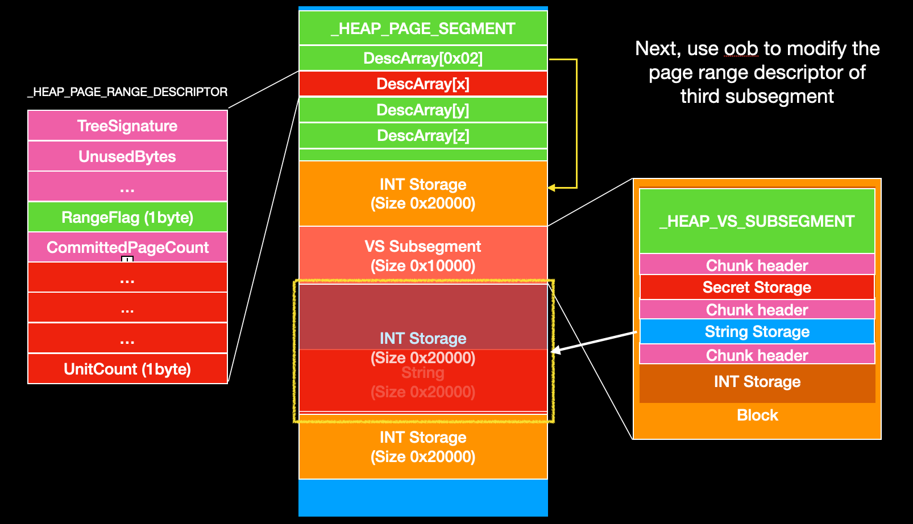
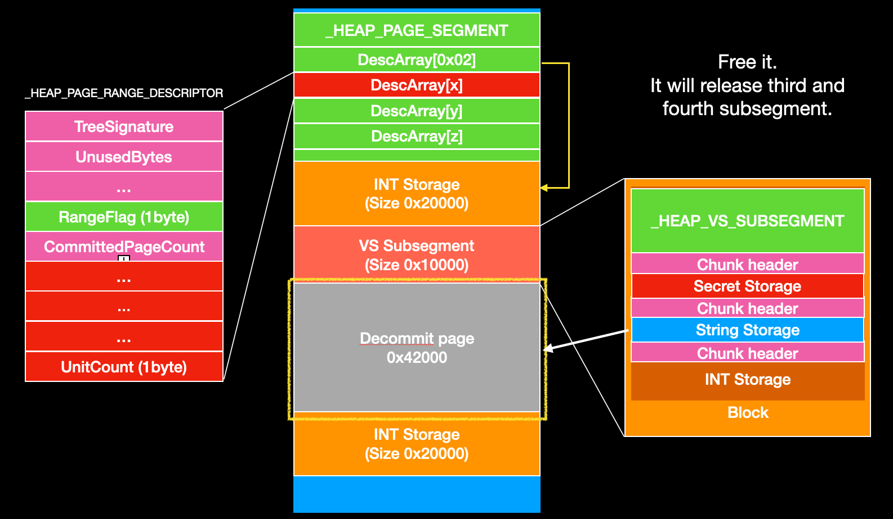

HITCON CTF 2020 Archangel Michael's Storage
-

## Description

### Environment

+ Windows x64 on Windows Server 20H@
+ DEP
+ ASLR
+ CFG
+ Private Heap
	+ Independent memoy pool
+ Segment Heap

### Note 
+ It a segment heap challenge
  + You can reference MarkYason's [talk]([MarkYason](https://www.blackhat.com/docs/us-16/materials/us-16-Yason-Windows-10-Segment-Heap-Internals.pdf)) to learn about the mechanism of segment heap
  + I will also release more about segment heap slide recently


### Progeam
+ A simple datastorate
  + You can use this storage to store integer,string,binary and some secret data
  + But you can only get string data
  
+ Structure 

```
struct int_storage {
    size_t Size;
    INT uintarray[1];
};

struct secret_storage {
    INT Size;
    UINT64 uintarray[1];
};
struct binary_storage {
    size_t Size;
    char content[1];
};

struct string_storage {
	size_t Size;
	char* content;
};

```
 + The size of integer,secret and binary structure are variable. And the data are store in the structure.

+ The size of string is fixed and the data is additional memory block which will be allocated when you allocate the storage.

### Features

+ Allocate Storage
  +  allocate a specific type storage
+ Set
  + Set a value to a storage
+ Get
  + Get a value from a storage
  + Only for string storage
+ Destory Storage
  + destory a storage
+ Security check
  + If the size of storage is changed after allocated, it will be considered illegal.

## Vulnerability
+ Out of bound write
  + It does not check negtive index when you set a value in the secret storage. It will lead to out of bound write. You can write int64 data to previous memory block.

```
if (secretarrayidx < SECRET_SIZE) {  //int64
        printf("Value:");
        obj_array[idx].secretstorage->uintarray[(INT)secretarrayidx] = read_long();
    }
```


## Exploit
### Create overlap chunk

+ Because it use private heap, we can easy use the oob write to write the metadata of the segment.

+ Our target is `_HEAP_PAGE_RANGE_DESCRIPTOR`. We can overwrite the `_HEAP_PAGE_RANGE_DESCRIPTOR->UnitCount` to make a large subsegment and free it. It will release the next subsegment which is being used. And than create it again we will get overlap chunk.

    + First, we can allocate 5 subsegment such as the diagram. and fill the VS subsegment

    

    + Next, use oob to modify the page range descriptor of third subsegment  

    


    + Free it. It will release third and fourth subsegmnt.

    

    + Allocate two subsegment int subsegment and new VS subsegment
      + because we fill the first VS subsegment, it will allocate new VS subsegment when we use VS Allocation.

    

    + Now we can allocate new string stroage structure in the new VS subsegment. We have a overlap chunk and we can use the first string storage to leak someting. We also can use secret storage to avoid null byte terminate. 

    

### Arbitrary memory reading and writing 
+ After we create overlap chunk, we can do arbitrary memory reading and writing by using string storage and secret storage.
+ After we can do arbitrary memory reading, we can use it to leak `_HEAP_VS_SUBSEGMENT->Flink` to get `_SEGMENT_HEAP`
+ We can leak ntdll from `_SEGMENT_HEAP->LfhContext->AffinityModArray`


### Control RIP
After we have arbitrary memory writing we can overwrite return address on stack with ROP