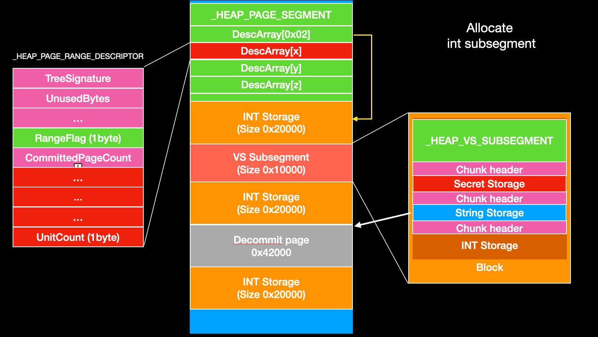
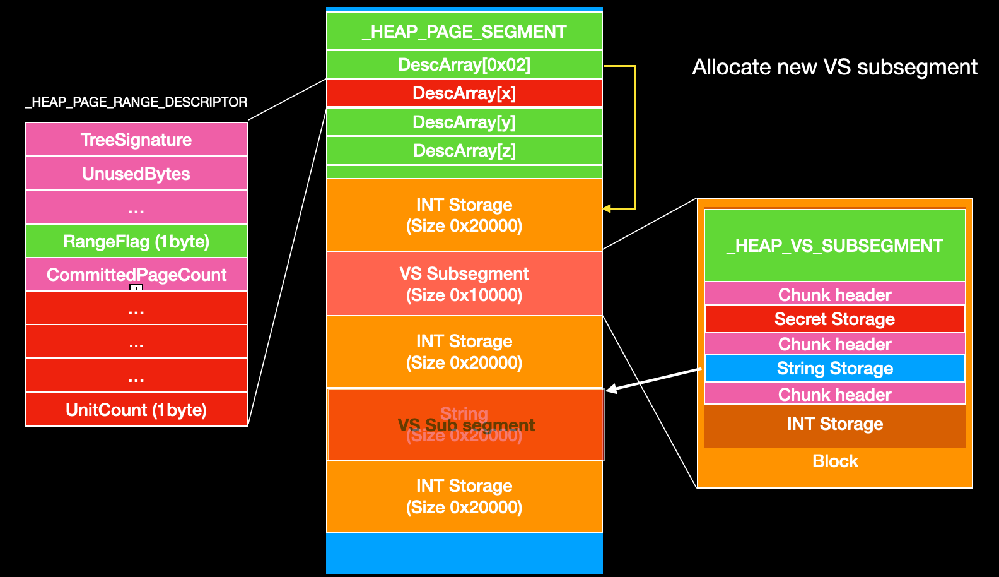
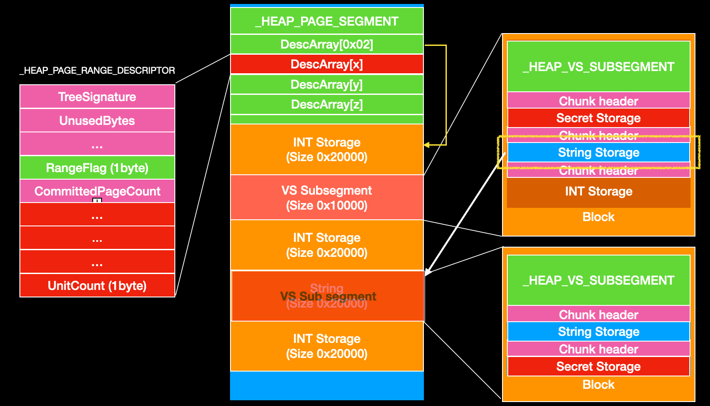

HITCON CTF 2020 Archangel Michael's Storage
-

## Description

### Environment

+ Windows x64 on Windows Server 20H@
+ DEP
+ ASLR
+ CFG
+ Private Heap
	+ Independent memoy pool
+ Segment Heap

### Note 
+ It a segment heap challenge
  + You can reference MarkYason's [talk](https://www.blackhat.com/docs/us-16/materials/us-16-Yason-Windows-10-Segment-Heap-Internals.pdf) to learn about the mechanism of segment heap
  + My slide for segment heap in windows kernel 
    + https://speakerdeck.com/scwuaptx/windows-kernel-heap-segment-heap-in-windows-kernel-part-1
    + It very similar to segment heap in userland.


### Progeam
+ A simple datastorate
  + You can use this storage to store integer,string,binary and some secret data
  + But you can only get string data
  
+ Structure 

```
struct int_storage {
    size_t Size;
    INT uintarray[1];
};

struct secret_storage {
    INT Size;
    UINT64 uintarray[1];
};
struct binary_storage {
    size_t Size;
    char content[1];
};

struct string_storage {
	size_t Size;
	char* content;
};

```
 + The size of integer,secret and binary structure are variable. And the data are store in the structure.

+ The size of string is fixed and the data is additional memory block which will be allocated when you allocate the storage.

### Features

+ Allocate Storage
  +  allocate a specific type storage
+ Set
  + Set a value to a storage
+ Get
  + Get a value from a storage
  + Only for string storage
+ Destory Storage
  + destory a storage
+ Security check
  + If the size of storage is changed after allocated, it will be considered illegal.

## Vulnerability
+ Out of bound write
  + It does not check negtive index when you set a value in the secret storage. It will lead to out of bound write. You can write int64 data to previous memory block.

```
if (secretarrayidx < SECRET_SIZE) {  //int64
        printf("Value:");
        obj_array[idx].secretstorage->uintarray[(INT)secretarrayidx] = read_long();
    }
```


## Exploit

### Plan
+ It looks very very easy !

  + We can use oob to overwrite string pointer with anything !
  + But ... 
    + We don’t know any address…

So we need do leak first !
Create overlap chunk is easy way !

### Create overlap chunk

+ Because it use private heap, we can easy use the oob write to write the metadata of the segment.
  + There are many idea that you easily think of:
    + Corrupt LFH bitmap 
    + Abusing VS chunk header

+ But there are many problems you will encounter
  + Corrupt LFH bitmap
    + Randomness of LFH chunk
  + Abusing VS chunk header 
    + Chunk header encoding

Our target is `_HEAP_PAGE_RANGE_DESCRIPTOR`. We can overwrite the `_HEAP_PAGE_RANGE_DESCRIPTOR->UnitCount` to make a large subsegment and free it. 

It will release the next subsegment which is being used. And then create it again we will get overlap chunk.

+ First, we can allocate 5 subsegment and fill the VS subsegment
 


+ Fill the VS subsegment


+ Next, use oob to modify the page range descriptor of 
third subsegment


+ Free it. It will release third and fourth subsegment.


+ Allocate int subsegment 



+ Allocate new VS subsegment


+ because we fill the first VS subsegment, it will allocate new VS subsegment when we use VS Allocation.


+ Now we can allocate new string storage structure in the new VS subsegment.
We have a overlap chunk and we can use the first string storage to leak something. We also can use secret storage to avoid null byte terminate.
We can use it to leak heap address



### Arbitrary memory reading and writing 

+ After we create overlap chunk, we can do arbitrary memory reading and writing by using string storage and secret storage.

+ After we can do arbitrary memory reading, we can use it to leak `_HEAP_VS_SUBSEGMENT->Flink` to get `_SEGMENT_HEAP`
We can leak ntdll from `_SEGMENT_HEAP->LfhContext->AffinityModArray`


### Control RIP
After we have arbitrary memory writing we can overwrite return address on stack with ROP